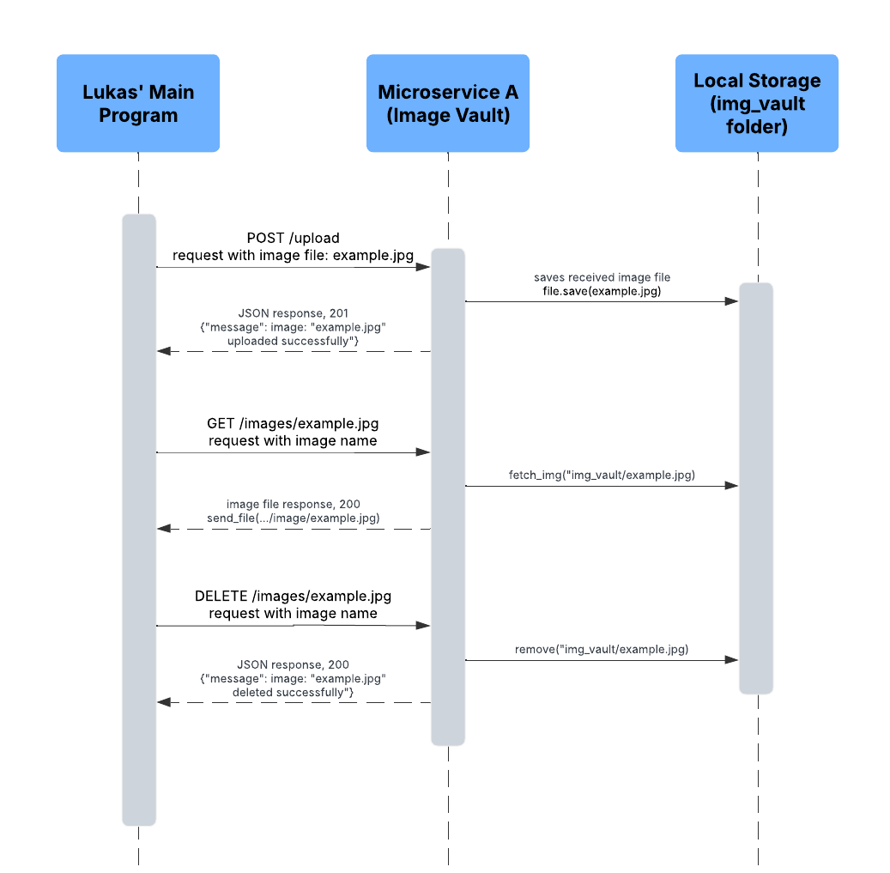

# Image Vault Microservice
A microservice that receives images and stores them in a locally stored folder, also retrieves, and deletes them through HTTP (communication pipe).
<br> by Louie Baobao
<br>
<br>

# How to Run
- Install Dependencies:
  - "pip install flask" or "requests"
- Run microservice: 
  - "python img_vault_ms.py"
- Setup local folder for storage:
  - create "img_vault" folder in same directory as the microservice
<br>
<br>

# UML Diagram
Upload, Retrieve, and Delete scenario.


# HTTP API endpoints
## -> Upload Image
- **Endpoint:** "/upload"
- **Method:** POST
- uploads an image file to microservice
### Example Call
```python
url = "http://127.0.0.1:5000/upload"
files = {"file": open("example.jpg", "rb")}
response = requests.post(url, files=files)

print(response.json())
```
<br>

## -> Retrieve Image
- **Endpoint:** "images/<img_name>"
- **Method:** GET
- retrieves an image file from microservice
### Example Call
```python
img_name = "example.jpg"
url = f"http://127.0.0.1:5000/images/{img_name}"
response = requests.get(url)

if response.status_code == 200:
    with open(img_name, "wb") as file:
        file.write(response.content)
else:
    print(response.json())
```
<br>

## -> Delete Image
- **Endpoint:** "images/<img_name>"
- **Method:** DELETE
- deletes an image file from microservice
### Example Call
```python
img_name = "example.jpg"
url = f"http://127.0.0.1:5000/images/{img_name}"
response = requests.delete(url)

print(response.json())
```
<br>

# Mitigation Plan
- For which teammate did you implement “Microservice A”?
  - > For Lukas' organizer main program.
- What is the current status of the microservice? Hopefully, it’s done!
  - > I think it's done (based on the Sprint 1 plan), but may need some minor changes or improvements in the future in case of issues when integrating with main program.
- How is your teammate going to access your microservice? Should they get your code from GitHub (if so, provide a link to your public or private repo)? Should they run your code locally? Is your microservice hosted somewhere? Etc.
  - > Through a private GitHub repo invitation. The microservice would be run locally.
- If your teammate cannot access/call YOUR microservice, what should they do? Can you be available to help them? What’s your availability?
  - > Contact through Discord server or direct message. 
- If your teammate cannot access/call your microservice, by when do they need to tell you?
  - > Immediately, as soon as possible.
- Is there anything else your teammate needs to know? Anything you’re worried about? Any assumptions you’re making? Any other mitigations / backup plans you want to mention or want to discuss with your teammate?
  - > The decision of either running the microservice locally or being hosted somewhere. Currently the microservice is set up for local, but if hosting is preferred, I'm worried that it would need more additional setup (maybe even more testing).
  - > If there are integration/compatibility issues, then I will update the Image Vault Microservice. 